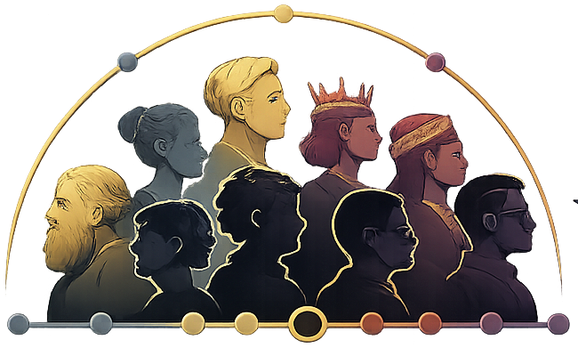

<p align="center">
  
</p>

<h1 align="center">wellknownable</h1>

<p align="center">
  <strong>Every well-known life in history, on a single interactive timeline.</strong><br />
  24,643 people · 3000 BC → today · zero runtime dependencies
</p>

<p align="center">
  <a href="https://wellknownable.com">wellknownable.com</a>
</p>

<!-- TODO: demo GIF here (search -> fly-to-era animation) -->

## What is this?

Type a name. Pick a person. The timeline flies to their era — and suddenly you see
who else walked the earth at the same time. Einstein overlaps with Atatürk, Gandhi
and Picasso; Galileo was born the same year as Shakespeare; Omar Khayyám shared a
century with William the Conqueror.

- **Semantic zoom** — from far out, centuries are bubbles sized by how many notable
  people were born in them; dive in and individual lives appear as bars placed at
  their real dates.
- **Search with fly-to** — an autocomplete over all 24,643 people; selecting one
  triggers a zoom-out-then-dive camera animation to their lifetime.
- **Fully self-contained** — the dataset is a static JSON file and all 19,700+
  portraits are self-hosted 128px thumbnails. Once deployed, the site depends on
  no external service at runtime.
- **Curated notability** — people are included by how many Wikipedia language
  editions cover them, with era-adjusted thresholds (10+ languages for antiquity,
  70+ for the modern flood).

## Data pipeline

Everything in [`_server/`](_server) is a plain Node script — no framework, no keys,
no accounts. The full dataset can be rebuilt from scratch:

| Script | What it does |
|---|---|
| `fetch-all.js` | Fetches every era from Wikidata (SPARQL), with per-era notability thresholds and resume support |
| `fetch-people.js` | Fetches one year range, in chunks that respect WDQS timeouts |
| `fix-labels.js` | Repairs names that came back as raw QIDs or in the wrong script |
| `enrich-people.js` | Adds occupation, country, birthplace coordinates and Wikipedia links |
| `download-images.js` | Downloads 128px portrait thumbnails from Wikimedia Commons |
| `build-dataset.js` | Merges everything into `src/data/people.json`, applies date-hygiene rules for "circa" antiquity dates |
| `health-report.js` | Field coverage + anomaly report (death-before-birth, 110+ lifespans, null-island coordinates...) |

```bash
cd _server
node fetch-all.js        # ~40 min, polite to WDQS
node fix-labels.js
node enrich-people.js    # ~25 min
node download-images.js  # ~1.5 h, polite to Commons
node build-dataset.js
node health-report.js
```

## Running locally

```bash
npm install
npm run dev
```

Vue 3 (Options API) + Pinia + a hand-rolled SVG timeline. No chart library.

## Data & attribution

- Person data: [Wikidata](https://www.wikidata.org) (CC0)
- Portraits: [Wikimedia Commons](https://commons.wikimedia.org) — mostly CC/public
  domain; every person card links back to the source for full attribution
- Notability idea: Wikipedia sitelink counts, in the spirit of the
  [Pantheon](https://pantheon.world) project
- Inspired by [ybogdanov/history-timeline](https://github.com/ybogdanov/history-timeline)
  and Wait But Why's *Horizontal History*

## The founding team

Search for `apsisxcoder` on the timeline. While you're there, say hi to **Avel**
(staff psychologist, cat, b. 2023) and **Kedi** (staff philosopher, cat, b. 2020) —
they supervised the entire project and shut down the build server twice.

## License

[MIT](LICENSE) — built by [apsisxcoder](https://github.com/apsisxcoder),
pair-programmed with [Claude Code](https://claude.com/claude-code).
